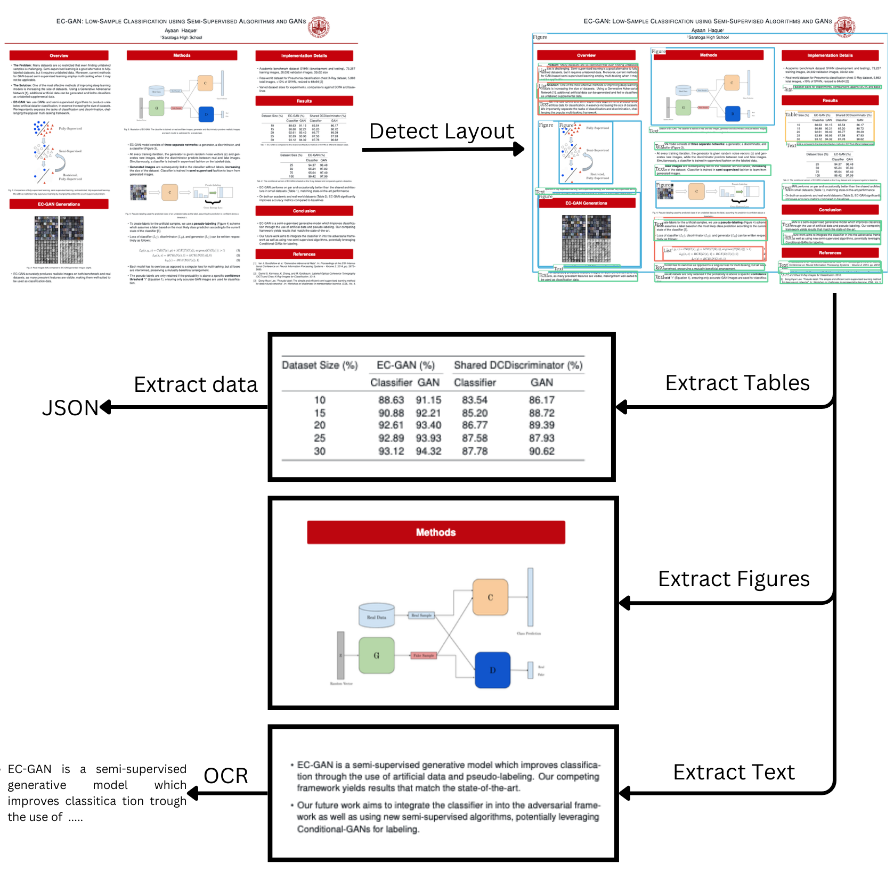

# Inkwell

### Quickstart on Colab
<a target="_blank" href="https://colab.research.google.com/drive/1AVeHmYk3nleXEZYys814pomo7cGbtAD-?usp=sharing">
  
</a>

### Overview

Inkwell is a modular Python library for extracting information from PDF documents documents with state of the art Vision Language Models. We make use of layout understanding models to improve accuracy of Vision Language models. 

Inkwell uses the following models, with more integrations in the work

* **Layout Detection**: Faster RCNN, LayoutLMv3, Paddle
* **Table Detection**: Table Transformer
* **Table Data Extraction**: Phi3.5-Vision, Qwen2 VL 2B, Table Transformer, OpenAI GPT4o Mini
* **OCR**: Tesseract, PaddleOCR, Phi3.5-Vision, Qwen2 VL 2B



## Installation

```bash
pip install py-inkwell[inference]
```

In addition, install detectron2

```bash
pip install git+https://github.com/facebookresearch/detectron2.git
```


Install [Tesseract](https://tesseract-ocr.github.io/tessdoc/Installation.html)

For Ubuntu - 

```bash
sudo apt install tesseract-ocr
sudo apt install libtesseract-dev
```

and, Mac OS

```bash
brew install tesseract
```

For GPUs, install flash attention and vllm for faster inference.

```bash
pip install flash-attn --no-build-isolation
pip install vllm
```

## Basic Usage

### Parse Pages 

```python
from inkwell.pipeline import Pipeline

pipeline = Pipeline()
document = pipeline.process("/path/to/file.pdf")
```

### Extract Page Elements
```python
pages = document.pages
```

Every Page has the following fragment objects -
1. Figures
2. Tables
3. Text

#### Figures 

Each figure fragment's content has the following attributes - 
1. bbox - The bounding box of the figure
2. text - The text in the figure, extracted using OCR
3. image - The cropped image of the figure

```python
figures = page.figure_fragments()

for figure in figures:
    figure_image = figure.content.image 
    figure_bbox = figure.content.bbox 
    figure_text = figure.content.text
```

#### Table 

Each table fragment's content has the following attributes - 
1. data - The data in the table, extracted using Table Extractor
2. bbox - The bounding box of the table
3. image - The image of the table, extracted using OCR

```python
tables = page.table_fragments()

for table in tables:
    table_data = table.content.data
    table_bbox = table.content.bbox
    table_image = table.content.image
```

#### Text 

Each text fragment's content has the following attributes - 
1. text - The text in the text block
2. bbox - The bounding box of the text block
3. image - The image of the text block

```python
text_blocks = page.text_fragments()

for text_block in text_blocks:
    text_block_text = text_block.content.text
    text_block_bbox = text_block.content.bbox
    text_block_image = text_block.content.image
```

### Complete Example
We will take the following PDF and extract text, tables and images from this separtely. 

```python

from inkwell.pipeline import Pipeline

pipeline = Pipeline()
document = pipeline.process("/path/to/file.pdf")
pages = document.pages

for page in pages:

    figures = page.figure_fragments()
    tables = page.table_fragments()
    text_blocks = page.text_fragments()

    # Check the content of the image fragments
    for figure in figures:
        figure_image = figure.content.image
        figure_text = figure.content.text
    
    # Check the content of the table fragments
    for table in tables:
        table_image = table.content.image
        table_data = table.content.data

    # Check the content of the text blocks
    for text_block in text_blocks:
        text_block_image = text_block.content.image
        text_block_text = text_block.content.text
```

## Using Qwen2/Phi3.5/OpenAI Vision Models

 We have defined a default config class [here](inkwell/pipeline/pipeline_config.py). You can add vision-language models to the config to use them instead of the default models. 

```python
from inkwell.pipeline import DefaultPipelineConfig, Pipeline
from inkwell.ocr import OCRType
from inkwell.table_extractor import TableExtractorType

# using Qwen2 2B Vision OCR anf Table Extractor
config = DefaultPipelineConfig(
    ocr_detector=OCRType.QWEN2_2B_VISION,
    table_extractor=TableExtractorType.QWEN2_2B_VISION
) 

# using Phi3.5 Vision OCR and Table Extractor
config = DefaultPipelineConfig(
    ocr_detector=OCRType.PHI3_VISION,
    table_extractor=TableExtractorType.PHI3_VISION
) 

# using OpenAI GPT4o Mini OCR and Table Extractor (Requires API Key)
config = DefaultPipelineConfig(
    ocr_detector=OCRType.OPENAI_GPT4O_MINI,
    table_extractor=TableExtractorType.OPENAI_GPT4O_MINI
) 

pipeline = Pipeline(config=config)
```

## Advanced Customizations

You can add custom detectors and other components to the pipeline yourself - follow the instructions in the [Custom Components](notebooks/demo_pipeline_custom.ipynb) notebook

### Acknowledgements

We derived inspiration from several open-source libraries in our implementation, like [Layout Parser](https://github.com/Layout-Parser/layout-parser) and [Deepdoctection](https://github.com/deepdoctection/deepdoctection). We would like to thank the contributors to these libraries for their work.